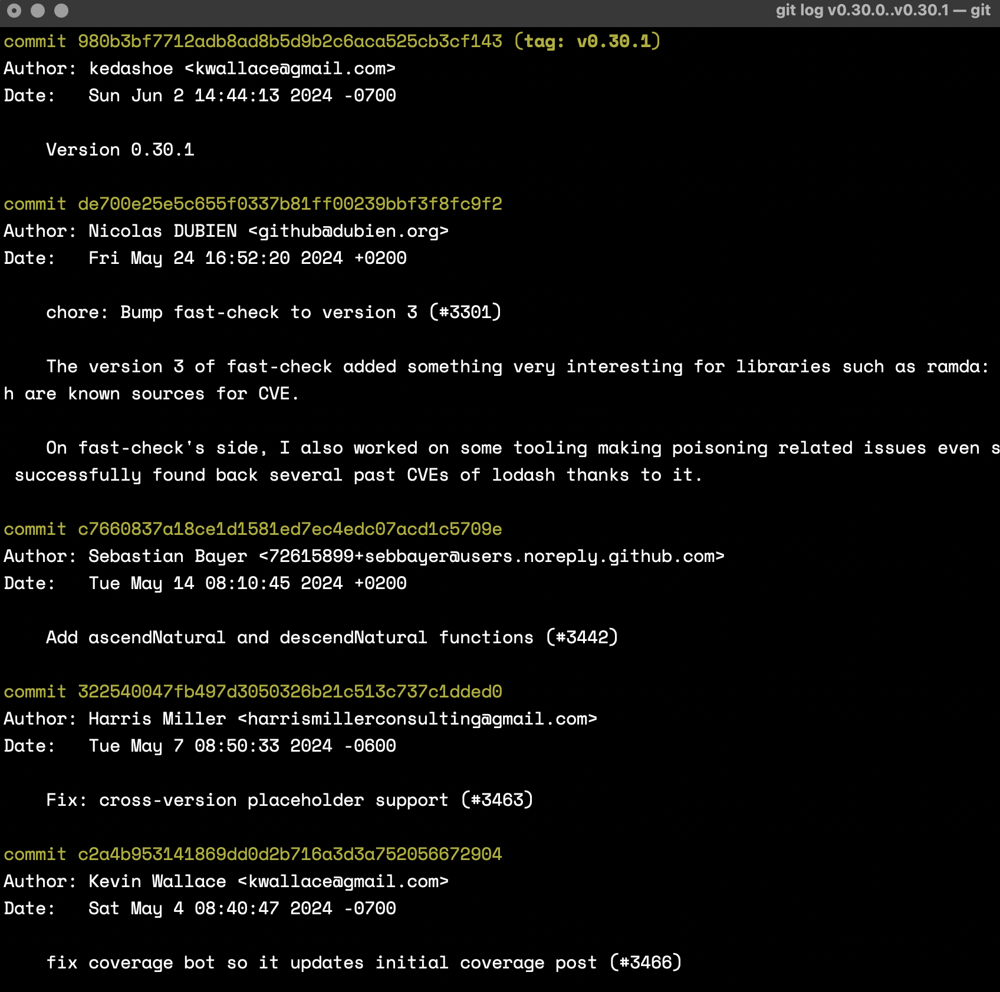

# Assignment 10 - GitHub Scavenger Hunt

## Part 1

### Question List

1. The commit message for the latest commit to this repo
2. The user that posted the first commit to this repo
3. The number of total commits that affected the **map.js** file
4. The contents of line 28 in the file **_flatCat.js**
5. The last user to make a change to the **filter-where.bench.js** file
6. The last user that edited line 253 of the **README.md** file
7. The reason why issue #2807 was resolved
8. The total number of closed issues that have the phrase “curry” in their title
9. The total number of pull requests created by user **buzzdecafe**
10. The total number of issues that have been assigned the label **wontfix**
11. The compare branch name for the pull request that updated **path** and **assocPath** to support negative indices
12. The user that has the second most commits in this repo’s **master** branch
13. The total number of users that have made a contribution to this repo
14. The installation instructions for using Ramda with node
15. The commits that were added for the newest released version of the Ramda package.

### Answers

1. The latest commit was pushed by [Harris Miller (Harris-Miller)](https://github.com/Harris-Miller) on February 6th, 2025. The message was "update _filterMap to use lower-level code to match ramda stanards".

2. We can find the last commit by using `git log --reverse` in the repo itself, and it returns that [Scott Sayet (CrossEye)](https://github.com/CrossEye) created the first commit on June 21st, 2013.

3. We can find the total commits that affected the **map.js** file by going to it's history and we can see that there are 15 total commits between 2014 and 2022.

4. Line 28 in **_flatCat.js** has the following code:

```js
var _flatCat = function _xcat(xf) { return new XFlatCat(xf); };
```


5. The last user to make a change to the **filter-where.bench.js** file was [Cotton Hou (imcotton)](https://github.com/imcotton) on January 22nd, 2022. The commit message was "Upgrade and fixing up eslint-plugin-import".

6. The last person to edit line 253 of the **README.md** file was [Rafael Calderon (RafaCalderonR)](https://github.com/RafaCalderonR). The commit ID is `332195ecf`.

7. The issue "Suggestion: toBoolean function #2807" was cleared because, as stated by [Matt Grande (mattgrande)](https://github.com/mattgrande.git), "JavaScript already has the Boolean constructor which does what you're looking for: `Boolean(x)`"

8. The total number of issues that contain the word "curry" is 66 (e.g. "TypeScript fails completion on reduce currying").

9. [buzzdecafe](https://github.com/buzzdecafe) has created 190 GitHub Issues.

10. The total number of issues that have been assigned the label **wontfix** is 17.

11. The compare branch name for the pull request that updated `path` and `assocPath` to support negative indices is `array-indices-assoc-path`.

12. [Scott Sayet (CrossEye)](https://github.com/CrossEye) has the second most commits to the master branch with 541.

13. The total number of contributors is 334 according to the GitHub website, but using `git shortlog -sn | wc -l` returns 376.


14. You can install ramda with Node by running:

```bash
npm install ramda
```


15. The commits that were added for the newest released version of the Ramda package (v0.30.1):

- **`c766083`** - *Add ascendNatural and descendNatural functions (#3442)*  
  ↳ Sebastian Bayer | May 14, 2024

- **`3225400`** - *Fix: cross-version placeholder support (#3463)*  
  ↳ Harris Miller | May 7, 2024

- **`c2a4b95`** - *fix coverage bot so it updates initial coverage post (#3466)*  
  ↳ Kevin Wallace | May 4, 2024

- **`6d83500`** - *Chore: make Flow jsdoc example runnable in the repl (#3462)*  
  ↳ Harris Miller | May 2, 2024

- **`dcaac73`** - *JSDoc: update `head()`, `last()`, and `nth()` to reflect actual behavior (#3459)*  
  ↳ Harris Miller | May 2, 2024

- **`ad50734`** - *update license for 2024 (#3454)*  
  ↳ Kevin Wallace | April 29, 2024



## Part 2

The repo is the same as [Assignment 9 (Challenge 1)](https://github.com/bjaxqq/qBay).